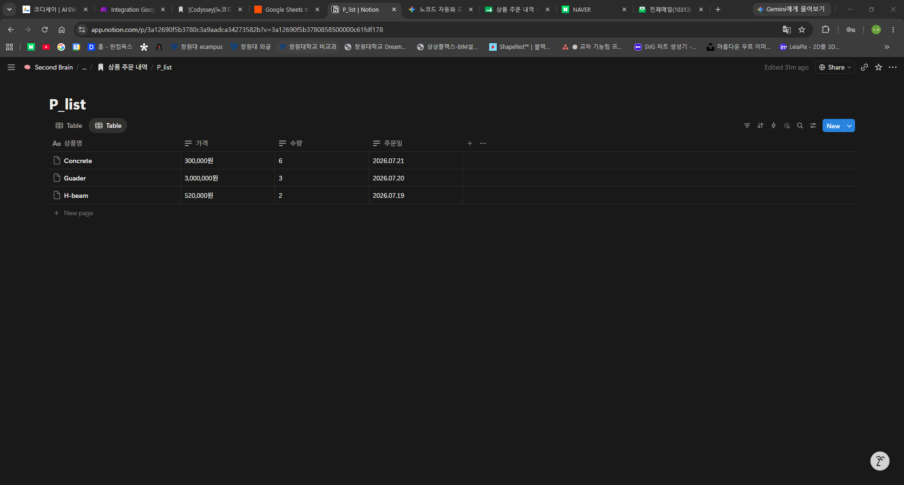
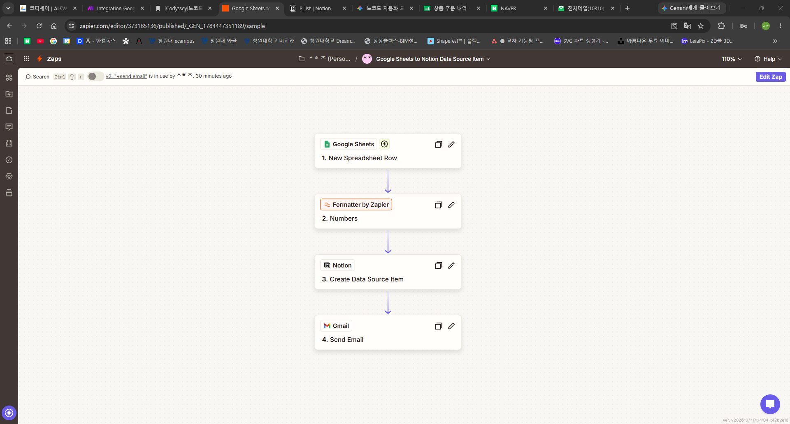

# [P1]자동화 도구 비교분석 보고서

## 워크플로우 선정

---

<aside>
1. [상품 주문 내역] Google Sheet에 입력된 새로운 행을 감지
2. 가격 셀의 폼을 원 단위로 변환(5000 → 5,000원)
3. [P_list] 노션 데이터베이스 각 속성에 세부 항목 입력
4. 추가 주문 내용 이메일로 전송
</aside>

## 1. Make

---

| 항목 | 내용 |
| --- | --- |
| 이름 | Make |
| 장점 |   1. 직관적인 드래그 앤 드롭 UI
2. 합리적인 비용 및 무료 플랜
3. 디테일한 실행 로그 |
| 단점 |   1. 초기 학습 장벽 존재
2. 용어의 생소함 |
| 특징 |   • 다중 조건 분기가 필요한 업무에 유리
• 기본 제공되지 않는 앱이더라도 커스텀API 활용 가능 |

#### 구현 과정 요약

1. Google Sheets의 Watch New Rows 모듈 생성
2. 계정 연동 및 연동할 스프레드 시트와 시트 이름 선택
3. Notion의 Create a Database Item(Legacy) 모듈 생성
4. 계정 연동 및 데이터베이스 ID 연동
5. 감지한 시트 각 셀의 내용을 노션의 새로운 페이지 속성 항목에 연결되도록 설정
6. Gmail의 Send an Email 모듈 생성
7. 받을 사람의 이메일 입력 및 메일 내용을 Watch New Rows의 입력값을 활용해 작성

8. 시트에 주문 정보 입력

9. 노션 데이터베이스에 주문 내용 및 변환된 포멧으로 데이터 삽입 확인

10. 메일 발송 확인

## 2. Zapier

---

| 항목 | 내용 |
| --- | --- |
| 이름 | Zapier |
| 장점 |   1. 전 세계에서 가장 많은 앱을 공식 지원
2. 위에서 아래로 흐르는 순차적인 구조
3. 안정성과 빠른 업데이트
4. 모듈 내에서도 단계별 설정 가능 |
| 단점 |   1. 실행 단가가 높은 편
2. 대량의 데이터를 반복 처리하기 부적절 |
| 특징 |   • 전문지식이 없어도 유지보수 용이함
• 직선적이고 정형화된 업무 프로세스를 쉽고 빠르게 자동화 가능 |

#### 구현 과정 요약

1. Google Sheets의 New Spreadsheet Row 모듈 생성
2. 계정 연동 및 연동할 스프레드 시트와 시트 이름 선택
3. Format by Zapier 모듈 생성
4. 해당 모듈을 통해 포멧 설정(5000 → 5,000원)
5. Notion의 Create Data Source Item 모듈 생성
6. 계정 연동 및 데이터베이스 ID 연동
7. 감지한 시트 각 셀의 내용을 노션의 새로운 페이지 속성 항목에 연결되도록 설정
8. Gmail의 Send Email 모듈 생성
9. 받을 사람의 이메일 입력 및 메일 내용을 New Spreadsheet Row의 입력값을 활용해 작성

10. 시트에 주문 정보 입력

11. 노션 데이터베이스에 주문 내용 및 변환된 포멧으로 데이터 삽입 확인

12. 메일 발송 확인

## 모델 비교

| 비교 기준 | Make | Zapier |
| --- | --- | --- |
| UI/UX | 시각적 노드(시나리오) 기반 드래그&드롭, 한 화면에서 흐름 파악 쉬움 | 위→아래 순차 리스트(단계) 기반, 설정 위자드가 직관적 |
| 설정 난이도 | 모듈 설정에 있어서 난이도가 높은 편 | 모듈 내에서도 단계별로 설정하도록 되어 있어 비교적 쉬운 편 |
| 연동 서비스 범위 | 대부분의 주요 서비스 지원 + 커스텀 API/HTTP로 확장 가능 | 공식 앱 커넥터가 매우 많고 업데이트가 빠름(광범위한 서비스 지원) |
| 가성비 | 무료 플랜·요금 대비 작업량(Ops) 효율이 좋은 편 | Task 단가가 높은 편이라 대량 실행에는 비용 부담 가능 |
| 적용 범위 | 훨씬 복잡한 업무의 자동화에 적합 | 간단하지만 번거로운 업무에 적합 |
