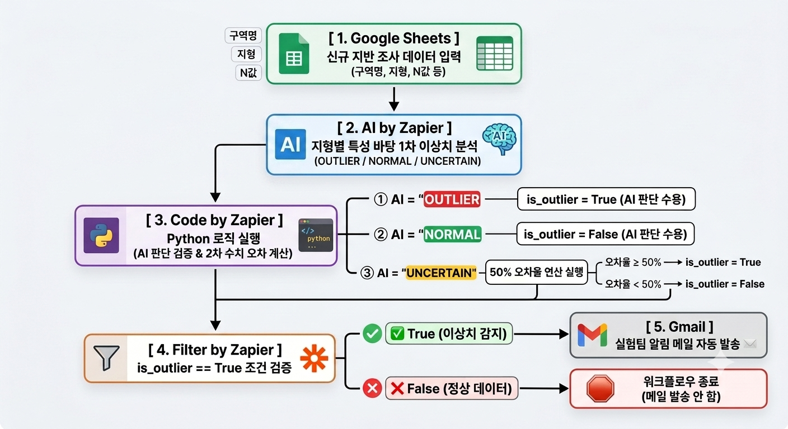
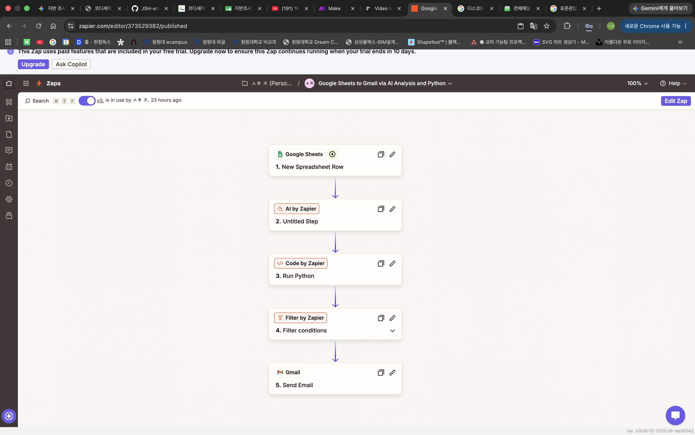
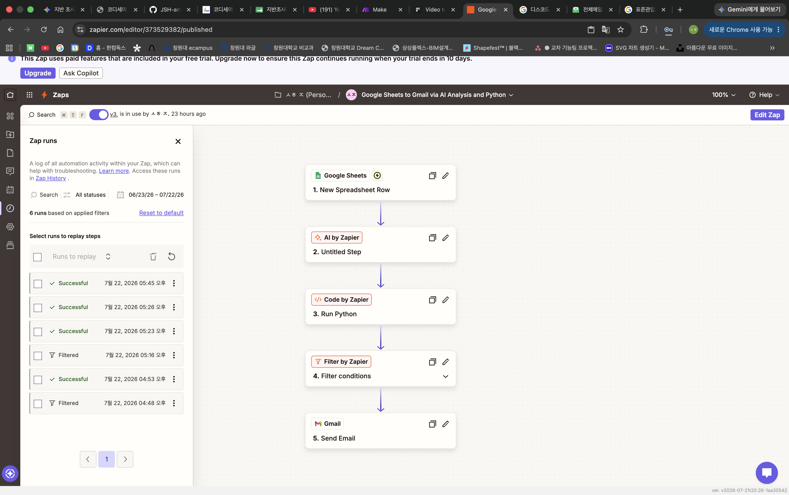
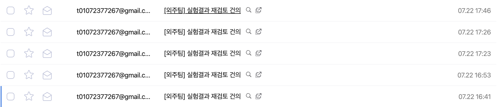
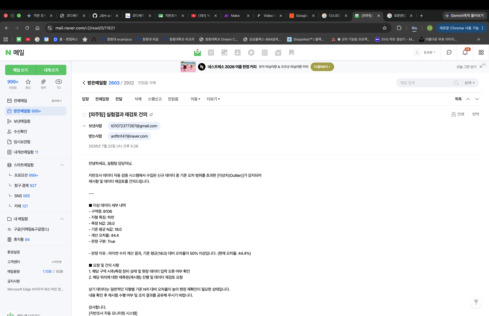

# [P1]자동화 도구 비교분석 보고서

## 워크플로우 선정

---

<aside>
1. [상품 주문 내역] Google Sheet에 입력된 새로운 행을 감지
2. 가격 셀의 폼을 원 단위로 변환(5000 → 5,000원)
3. [P_list] 노션 데이터베이스 각 속성에 세부 항목 입력
4. 추가 주문 내용 이메일로 전송
</aside>

## 1. Make

---

| 항목 | 내용 |
| --- | --- |
| 이름 | Make |
| 장점 |   1. 직관적인 드래그 앤 드롭 UI</p>2. 합리적인 비용 및 무료 플랜</p>3. 디테일한 실행 로그 |
| 단점 |   1. 초기 학습 장벽 존재</p>2. 용어의 생소함 |
| 특징 |   • 다중 조건 분기가 필요한 업무에 유리</p>• 기본 제공되지 않는 앱이더라도 커스텀API 활용 가능 |

#### 구현 과정 요약

1. Google Sheets의 Watch New Rows 모듈 생성
2. 계정 연동 및 연동할 스프레드 시트와 시트 이름 선택
3. Notion의 Create a Database Item(Legacy) 모듈 생성
4. 계정 연동 및 데이터베이스 ID 연동
5. 감지한 시트 각 셀의 내용을 노션의 새로운 페이지 속성 항목에 연결되도록 설정
6. Gmail의 Send an Email 모듈 생성
7. 받을 사람의 이메일 입력 및 메일 내용을 Watch New Rows의 입력값을 활용해 작성


8. 시트에 주문 정보 입력


9. 노션 데이터베이스에 주문 내용 및 변환된 포멧으로 데이터 삽입 확인


10. 메일 발송 확인


## 2. Zapier

---

| 항목 | 내용 |
| --- | --- |
| 이름 | Zapier |
| 장점 |   1. 전 세계에서 가장 많은 앱을 공식 지원</p>2. 위에서 아래로 흐르는 순차적인 구조</p>3. 안정성과 빠른 업데이트</p>4. 모듈 내에서도 단계별 설정 가능 |
| 단점 |   1. 실행 단가가 높은 편</p>2. 대량의 데이터를 반복 처리하기 부적절 |
| 특징 |   • 전문지식이 없어도 유지보수 용이함</p>• 직선적이고 정형화된 업무 프로세스를 쉽고 빠르게 자동화 가능 |

#### 구현 과정 요약

1. Google Sheets의 New Spreadsheet Row 모듈 생성
2. 계정 연동 및 연동할 스프레드 시트와 시트 이름 선택
3. Format by Zapier 모듈 생성
4. 해당 모듈을 통해 포멧 설정(5000 → 5,000원)
5. Notion의 Create Data Source Item 모듈 생성
6. 계정 연동 및 데이터베이스 ID 연동
7. 감지한 시트 각 셀의 내용을 노션의 새로운 페이지 속성 항목에 연결되도록 설정
8. Gmail의 Send Email 모듈 생성
9. 받을 사람의 이메일 입력 및 메일 내용을 New Spreadsheet Row의 입력값을 활용해 작성


10. 시트에 주문 정보 입력


11. 노션 데이터베이스에 주문 내용 및 변환된 포멧으로 데이터 삽입 확인


12. 메일 발송 확인


## 모델 비교

| 비교 기준 | Make | Zapier |
| --- | --- | --- |
| UI/UX | 시각적 노드(시나리오) 기반 드래그&드롭, 한 화면에서 흐름 파악 쉬움 | 위→아래 순차 리스트(단계) 기반, 설정 위자드가 직관적 |
| 설정 난이도 | 모듈 설정에 있어서 난이도가 높은 편 | 모듈 내에서도 단계별로 설정하도록 되어 있어 비교적 쉬운 편 |
| 연동 서비스 범위 | 대부분의 주요 서비스 지원 + 커스텀 API/HTTP로 확장 가능 | 공식 앱 커넥터가 매우 많고 업데이트가 빠름(광범위한 서비스 지원) |
| 가성비 | 무료 플랜·요금 대비 작업량(Ops) 효율이 좋은 편 | Task 단가가 높은 편이라 대량 실행에는 비용 부담 가능 |
| 적용 범위 | 훨씬 복잡한 업무의 자동화에 적합 | 간단하지만 번거로운 업무에 적합 |


---


# [P2]자유 주제 자동화 설계 및 구현

## 🔍 반복 업무 선정

---

<aside>
 
###  반복 업무 및 워크플로우

→ 건설 업계에서는 건물을 올리기 전 부지의 전반적인 토질 조사를 실시한다. 그중 흔히 사용하는 방법이 표준관입시험이다. 표준관입시험으로 N값을 얻을 수 있는데, 이때 N은 중량 63.5kg의 해머를 76cm 높이에서 낙하시켜, 샘플러를 지반에 30cm 관입시키는 데 필요한 타격 횟수를 말한다. N값으로 해당 지반의 특성을 파악할 수 있다. 

 이에 따라 주변 지형의 N값과는 다르게 문제가 있다고 판단되는 위치에서는 재시험을 하거나 기초의 크기를 키우는 식의 대체방안들을 사용한다. 토질 연구실 학부연구생으로서 엑셀에 추가되는 실험 결과를 자동으로 감지하여 N값의 이상치를 판별하고 이상이 있다고 판별될 시 실험팀에게 메일을 전송하는 일종의 실무 시뮬레이션을 진행하였다.



**[1단계] Google Sheets (데이터 트리거)**
• **역할**: 신규 지반 조사 데이터 입력 및 워크플로우 개시
• **수집 항목**: 구역명, 지형 특성, N값 등 주요 지반 데이터

**[2단계] AI by Zapier (1차 AI 이상치 분석)**
• **역할**: 지형별 특성 데이터를 기반으로 데이터의 이상 여부 1차 분류
• **분류 결과**:
    ◦ `OUTLIER` (이상치)
    ◦ `NORMAL` (정상)
    ◦ `UNCERTAIN` (불확실)

 ◦ AI 수행 **프롬프트 전문** : 

```python
당신은 유능한 토목 엔지니어 입니다.
아래 전달된 지반조사 데이터를 바탕으로 해당 지형의 일반적인 지반 특성 대비 N값의 이상유무를 판별할 것.

[지형별 일반 N치 상식 기준]
- 해안가: 연약~중등 지반 (평균 12.5 수준 / 10~15 범위 정상)
- 하천: 중등 지반 (평균 18.0 수준 / 15~22 범위 정상)
- 내륙: 조밀 지반 (평균 28.3 수준 / 25~35 범위 정상)
- 산악: 매우 조밀/암반 지반 (평균 41.7 수준 / 38~50 범위 정상)

[입력 데이터]
- 구역명 : {{=gives["373529382"]["COL$A"]}}
- 지형 특징 : {{=gives["373529382"]["COL$D"]}}
- 측정 N값 : {{=gives["373529382"]["COL$E"]}}

[판정 및 출력 규칙]
1. 지형 특성에 비해 N값이 현저히 낮거나 높은 명백한 이상치일 경우: OUTLIER
2. 지형 특성 범위 내에 잘 부합하는 정상 데이터일 경우: NORMAL
3. 데이터가 경계선에 있어 모호하거나 AI 수준에서 판단하기 어려운 경우: UNCERTAIN

반드시 첫 줄에 지정된 판정 단어 중 하나를 포함하여 아래 형식으로 출력하세요.

판정: [OUTLIER / NORMAL / UNCERTAIN 중 하나]
이유: [지형 및 N치에 따른 판단 이유를 한 줄로 간결히 서술]
```

**[3단계] Code by Zapier (Python 로직 검증 & 2차 연산)**
• **역할**: AI 판단 결과 검증 및 조건별 `is_outlier` (True/False) 최종값 확정
• **세부 조건 로직**:
    ◦ **AI = `OUTLIER`**: AI 판단 수용 →  `is_outlier = True`
    ◦ **AI = `NORMAL`**: AI 판단 수용 →  `is_outlier = False`
    ◦ **AI = `UNCERTAIN`**: 50% 오차율 연산 실행
        ▪ 오차율 **50% 이상** (≥50%) → `is_outlier = True`
        ▪ 오차율 **50% 미만** (<50%) →  `is_outlier = False`

◦ **AI 수행 프롬프트 전문** : 

```python
# 1. 지형별 대표 기준 평균 N값
AVG_N_TABLE = {
    "해안가": 12.5,
    "하천": 18.0,
    "내륙": 28.3,
    "산악": 41.7
}

# 2. Input Data 읽어오기
raw_ai_result = input_data.get('ai_result', '').strip()
raw_terrain = input_data.get('terrain', '').strip()
raw_n = input_data.get('new_n', 0)

try:
    new_n = float(raw_n)
except (ValueError, TypeError):
    new_n = 0.0

avg_n = AVG_N_TABLE.get(raw_terrain, 0.0)
error_rate = round((abs(new_n - avg_n) / avg_n) * 100, 1) if avg_n > 0 else 0.0

is_outlier = False
judge_by = ""
reason = ""

# 3. AI 판단 결과 1차 검증 및 Fallback(수치 연산) + 사유 지정
if "OUTLIER" in raw_ai_result.upper():
    is_outlier = True
    judge_by = "AI (이상치 감지)"
    reason = f"AI 직접 분석: {raw_ai_result}"  # AI의 실제 분석 소견 출력
elif "NORMAL" in raw_ai_result.upper():
    is_outlier = False
    judge_by = "AI (정상 판정)"
    reason = f"AI 직접 분석: {raw_ai_result}"
else:
    judge_by = "Python Code (50% 수치 오차 계산)"
    if avg_n > 0 and error_rate >= 50.0:
        is_outlier = True
        reason = f"파이썬 수치 계산 결과, 기준 평균({avg_n}) 대비 오차율이 50% 이상입니다. (현재 오차율: {error_rate}%)"
    else:
        is_outlier = False
        reason = f"파이썬 수치 계산 결과 정상 (현재 오차율: {error_rate}%)"

# 4. Output 생성
output = {
    "is_outlier": is_outlier,
    "judge_by": judge_by,
    "reason": reason,
    "terrain": raw_terrain,
    "new_n": new_n,
    "avg_n": avg_n,
    "error_rate": error_rate
}
```

**[4단계] Filter by Zapier (조건 검증)**
• **역할**: `is_outlier == True` 조건 충족 여부 확인 후 분기 처리

**[5단계] Gmail / 워크플로우 종료 (분기 실행)**
• 🟢 **True (이상치 감지)**: `[5. Gmail]`로 분기하여 **실험팀에 자동 알림 메일 발송 ✉️**
• 🔴 **False (정상 데이터)**: 별도 메일 발송 없이 **워크플로우 즉시 종료 🛑**

</aside>

## ⚙️ 자동화 도구 선정

| 선정 도구 | Zapier |
| --- | --- |
| 선정 이유 | 선정한 반복 업무가 비교적 간단하고 Make에 비해 모듈설정이 용이 |

## ✅ 워크플로우 실행 결과

- 설계한 워크플로우 화면



- 6회에 걸쳐 테스트 및 세부 설정 업데이트


- 워크시트에 파일 추가 시 필터 조건에 맞게 메일이 발송되거나 필터 조건 미달성시 메일 미발송



- 메일이 발송된 모습




